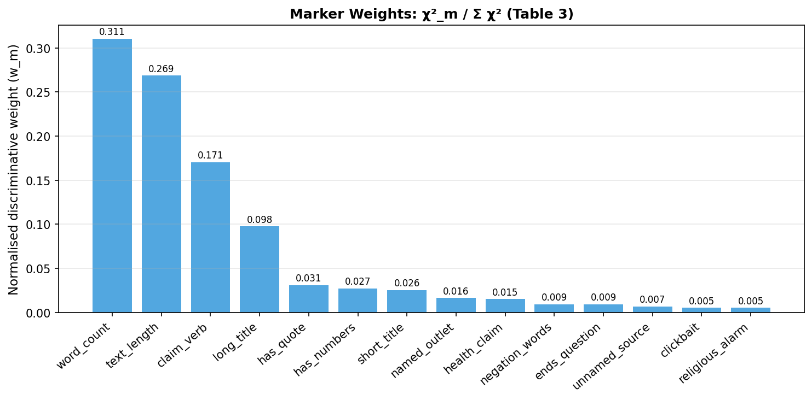
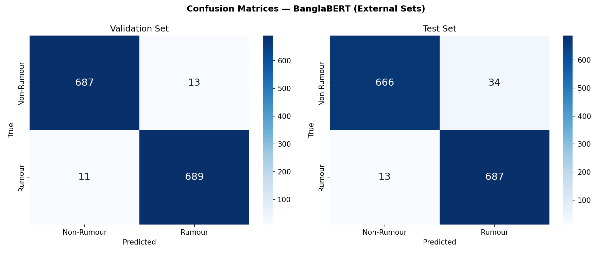

# MisInfo-11K: Interpretable Bangla Rumour Detection

ACL ARR 2026 Submission (Under Review)

## Overview

This repository contains the complete research pipeline for Bangla rumour detection using:

- MisInfo-11K Dataset
- Linguistic Marker Analysis
- Marker Signal Void (MSV)
- Traditional Machine Learning
- Transformer Models

## Dataset

- Total Samples: 11,198
- Domains:
  - Political
  - Health
  - Religious
  - Cultural
  - Sports
  - Celebrity
  - International

## Key Contributions

### Dataset Construction

- RumorScanner scraping
- Jachai scraping
- Verified news scraping

### Linguistic Marker Analysis

14 handcrafted linguistic deception markers.

### Marker Signal Void (MSV)

Novel framework for identifying signal-poor misinformation instances.

### Traditional ML Models

- Logistic Regression
- SVM
- Random Forest
- XGBoost

### Transformer Models

- BanglaBERT
- MuRIL
- XLM-RoBERTa

## Results

| Model | Test Macro F1 |
|---------|---------|
| Logistic Regression | 0.9693 |
| SVM | 0.9643 |
| Random Forest + Markers | 0.9750 |
| BanglaBERT | 0.9779 |
| MuRIL | 0.9793 |

## Visualizations

### Domain Fingerprints

### Marker Importance

### Confusion Matrix

